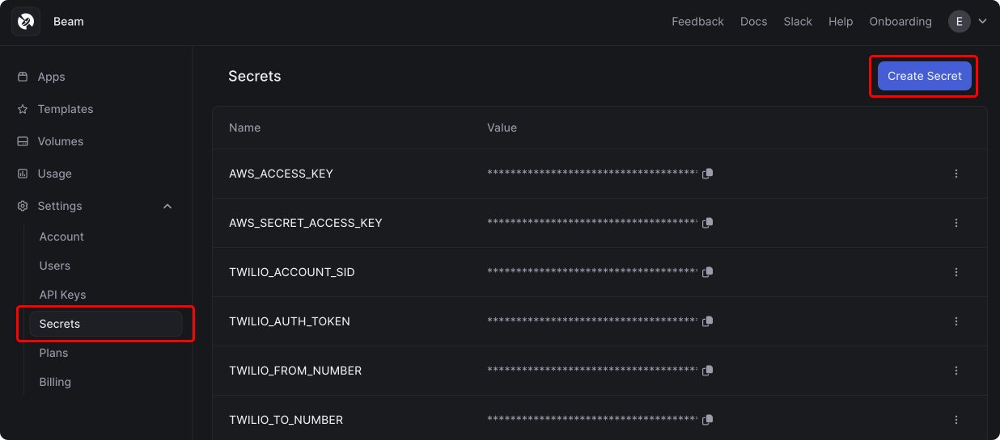

# Serverless API for CodeLlama 

## Pre-requisities 

First, create an account on [Beam](https://beam.cloud). It's free and you'll get 10 hours of GPU credit to start. Follow the steps in the onboarding to install the CLI and save your client credentials.

You'll also need to add your `HUGGINGFACE_API_KEY` to the [Beam Secret Manager](https://www.beam.cloud/dashboard/settings/secrets) to run this example.



## Clone Inference Script

Once you've [installed the Beam CLI](https://docs.beam.cloud/getting-started/installation), download the inference script to your computer. You can clone this repo, or just run this command:

```sh
beam create-app codellama
```

## Run Inference

You can run this inference script on a remote GPU with this command:

```sh
beam run app.py:generate
```

## Deploy

When we're ready to deploy, we'll enter the shell and use the `beam deploy` command:

```sh
beam deploy app.py:generate
```

When you run this command, your browser window will open the Beam Dashboard. You can copy the cURL or Python request to call the API:


