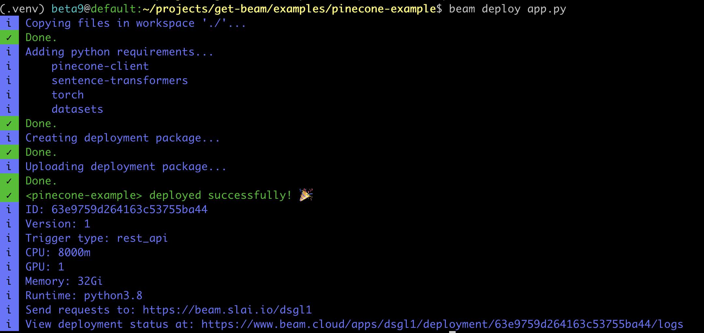

## Serverless Question Answering with Pinecone and Beam 

Beam is an ML platform that provides access to serverless GPUs for training and inference.

In this example, we'll setup an app with Pinecone for extractive question answering, and deploy it as a serverless REST API endpoint. 

This example is based heavily on the [Extractive Question Answering example](https://docs.pinecone.io/docs/extractive-question-answering).

This example requires free accounts on [Beam](https://beam.cloud), [Pinecone](https://pinecone.io), and [Huggingface](https://huggingface.co), as well as the [Beam CLI](https://docs.beam.cloud/getting-started/cli) and [Python SDK](https://docs.beam.cloud/getting-started/sdk) installed.

## Setup a Beam GPU Environment 

```python
import beam

# App configuration -- this is the compute the app will run on
app = beam.App(
    name="pinecone-example",
    cpu=8,
    gpu="A10G",
    memory="32Gi",
    python_packages=[
        "pinecone-client",
        "sentence-transformers",
        "torch",
        "datasets",
    ],
)
```

In your shell, run `beam start app.py`. This will create a GPU environment, and connect it to your shell -- any code you run in your shell will be run in a remote container Beam created for you!

## Create a Pinecone Index

We'll initialize Pinecone and create an index if it doesn't already exist:

```python
def get_or_create_index():
    # Add your Pinecone credentials to the Beam Secrets Manager: beam.cloud/dashboard/settings/secrets
    # If you don't have a Pinecone account, you can create one here: app.pinecone.io
    pinecone.init(
        api_key=os.environ["PINECONE_API_KEY"],
        environment=os.environ["PINECONE_ENVIRONMENT"],
    )

    index_name = "extractive-question-answering"
    # Check if the index already exists
    if index_name not in pinecone.list_indexes():
        # Create the index if it does not exist
        pinecone.create_index(index_name, dimension=384, metric="cosine")

    # Connect to index
    index = pinecone.Index(index_name)
    return index
```

## Seeding Pinecone with Question and Answer Embeddings

This function does a few things:

- Loads an 85mb dataset of questions and answers (Stanford Question Answering Dataset, or SQuAD for short)
- Uses the `multi-qa-MiniLM-L6-cos-v1` model from Huggingface to encode the questions and answers in the dataset into vector space, and generates embeddings for them
- Uploads the generated embeddings to Pinecone

```python
def initialize_retriever():
    # Load the squad dataset into a pandas dataframe
    df = load_dataset("squad", split="train").to_pandas()
    # Select only title and context column
    df = df[["title", "context"]]
    # Drop rows containing duplicate context passages
    df = df.drop_duplicates(subset="context")
    # Load the retriever model from huggingface model hub
    retriever = SentenceTransformer("multi-qa-MiniLM-L6-cos-v1")

    # We will use batches of 64
    batch_size = 64

    for i in tqdm(range(0, len(df), batch_size)):
        # Find end of batch
        i_end = min(i + batch_size, len(df))
        # Extract batch
        batch = df.iloc[i:i_end]
        # Generate embeddings for batch
        emb = retriever.encode(batch["context"].tolist()).tolist()
        # Get metadata
        meta = batch.to_dict(orient="records")
        # Create unique IDs
        ids = [f"{idx}" for idx in range(i, i_end)]
        # Add all to upsert list
        to_upsert = list(zip(ids, emb, meta))
        # Upsert/insert these records to pinecone
        index = get_or_create_index()
        _ = index.upsert(vectors=to_upsert)

    # Check that we have all vectors in index
    index.describe_index_stats()
```

### Extracting Answers from Questions

We'll use a question-answering model from Huggingface to extract answers from the question prompts:

```python
def get_reader():
    model_name = "deepset/electra-base-squad2"
    # Load the reader model into a question-answering pipeline
    reader = pipeline(
        tokenizer=model_name,
        model=model_name,
        task="question-answering",
        cache_dir="./cached_models",  # Cache model in the Persistent Volume mounted in app.py
    )
    return reader
```

## Generating Answers and Context

The `get_context` function retrieves the context embeddings containing answers to our question from the Pinecone index, and the `extract_answer` function extracts the answers from these context passages.

```python
def get_context(**inputs):
    # Load the question as a kwarg, passed in from the API
    question = inputs["question"]

    index = get_or_create_index()
    retriever = SentenceTransformer("multi-qa-MiniLM-L6-cos-v1")
    # Generate embeddings for the question
    question_embeddings = retriever.encode([question]).tolist()
    # Search Pinecone index for context passage with the answer
    pinecone_response = index.query(question_embeddings, top_k=1, include_metadata=True)
    # Extract the context passage from pinecone search result
    context = [i["metadata"]["context"] for i in pinecone_response["matches"]]
    return context
```

# Extracts answer from the context passage

```python
def extract_answer(**inputs):
    # Load the question as a kwarg, passed in from the API
    question = inputs["question"]
    context = inputs["context"]

    results = []

    reader = get_reader()
    for c in context:
        # Feed the reader the question and contexts to extract answers
        answer = reader(question=question, context=c)
        # Add the context to answer dict for printing both together
        answer["context"] = c
        results.append(answer)
    # Sort the result based on the score from reader model
    sorted_result = sorted(results, key=lambda x: x["score"], reverse=True)
    return sorted_result
```

## Inference 

We'll put all of this into a mini function to orchestrate the incoming API calls:

```python
def answer_question(**inputs):
    question = inputs["question"]

    context = get_context(question=question)
    res = extract_answer(question=question, context=context)

    for r in res:
        answer = r["answer"]
        context = r["context"]

    return {"answer": answer, "context": context}
```

## Deploying on Beam

To deploy this as a web endpoint, return to your `app.py` file and add a REST API Trigger.

You'll define your input (a question, as a string), the outputs (an answer and the context for it), and the handler (the function that runs when the API is invoked).

We'll also add a Persistent Volume to cache the Huggingface model, so we don't need to download it each time the model is invoked.

```python
# Add a REST API Trigger to deploy this app as a web endpoint
app.Trigger.RestAPI(
    inputs={
        "question": beam.Types.String()
    },  # Takes a question as input -- this is passed as a keyword argument to the handler function
    outputs={
        "answer": beam.Types.String(),
        "context": beam.Types.String(),
    },  # Returns an answer
    handler="run.py:answer_question",  # This is the function that will be run when the endpoint is invoked
)

# This volume is used to cache the Huggingface model
app.Mount.PersistentVolume(app_path="./cached_models", name="cached-models")
```

To deploy the app as a web endpoint, enter your shell and run:

```cURL
beam deploy app.py
```

You'll see an API printed out in the shell:



## Example Request

```cURL
 curl -X POST --compressed "https://api.beam.cloud/cjm9u" \
   -H 'Authorization: Basic [YOUR_AUTH_TOKEN]' \
   -H 'Content-Type: application/json' \
   -d '{"question": "who invented pizza?"}'
```

## Example Response

```cURL
{ "answer": "Luigi Pieragostini. A second New Haven gastronomical claim to fame is Louis' Lunch, which is located in a small brick building on Crown Street and has been serving fast food since 1895. Though fiercely debated, the restaurant's founder Louis Lassen is credited by the Library of Congress with inventing the hamburger and steak sandwich. Louis' Lunch broils hamburgers, steak sandwiches and hot dogs vertically in original antique 1898 cast iron stoves using gridirons, patented by local resident Luigi Pieragostini in 1939, that hold the meat in place while it cooks." }
```

## Next Steps

It's easy to run this example yourself. Just clone the repo, `cd` into the directory, and run `beam start app.py`. You can customize this example in your very own GPU environment and deploy it as a REST API when you're ready to hit prod.
