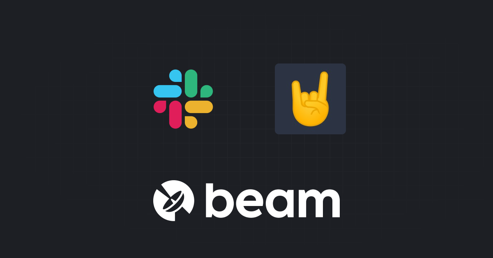
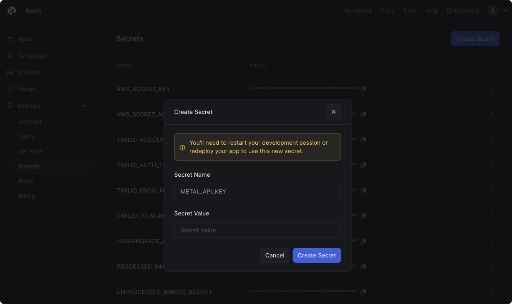
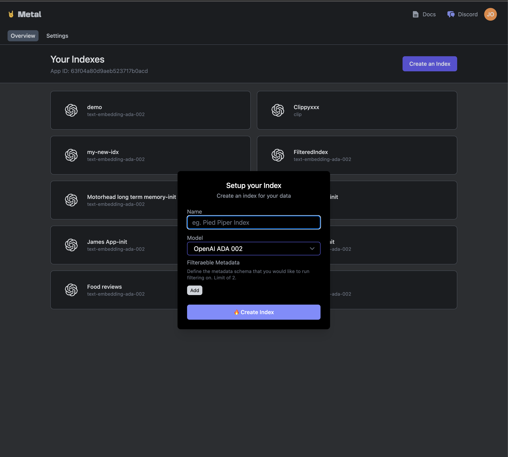
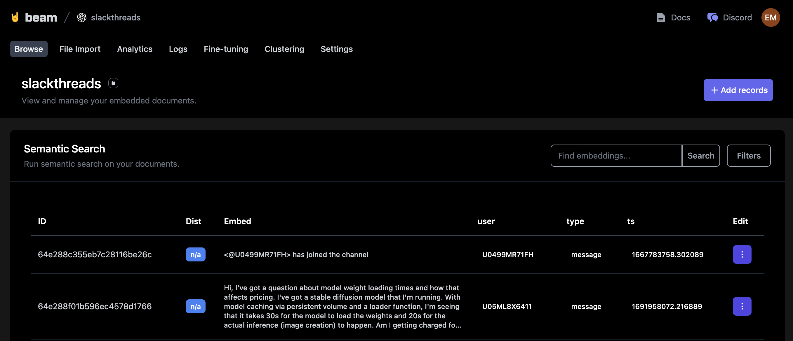
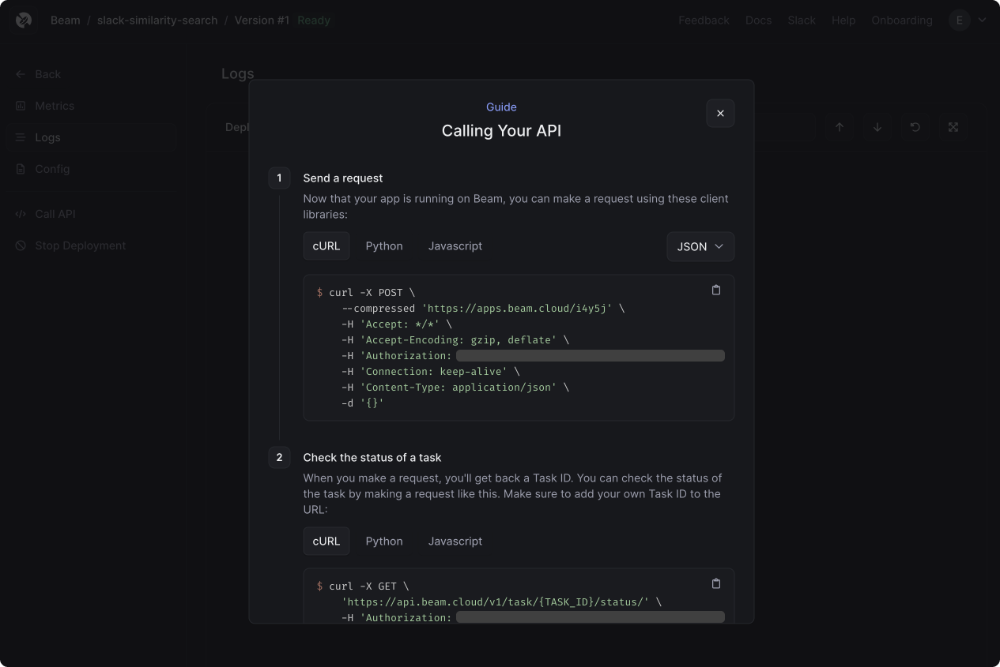
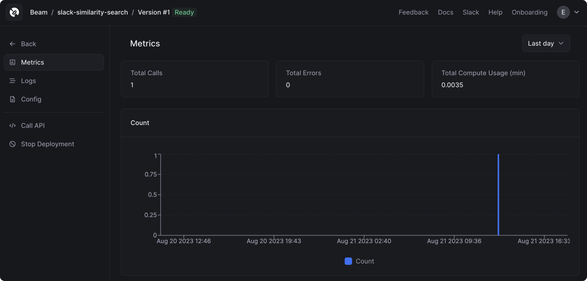
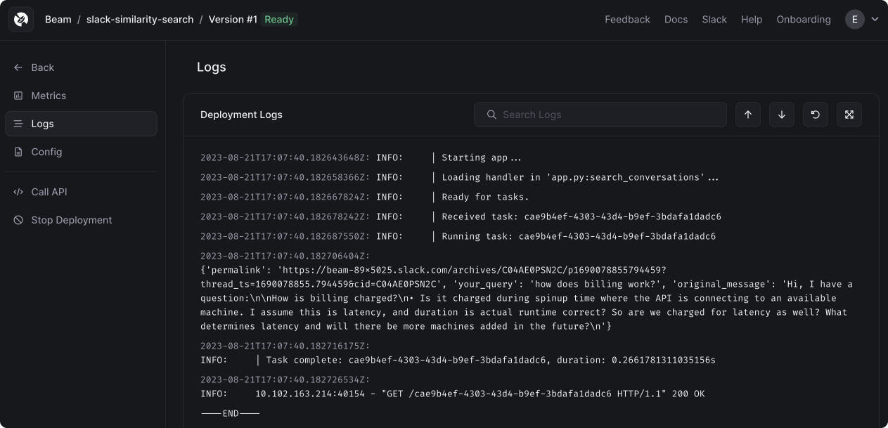

# Slack Similarity Search, Powered by Metal



At Beam, we help people easily run AI apps on cloud GPUs. We have a lively support channel in Slack where we provide world-class™ technical support. 

We've been looking to automate parts of our support workflow. We've noticed many of the same questions getting asked over time, and we sometimes find ourselves copying and pasting answers from old threads.

In this example, we're going to build a simple API to take a support question (i.e. "how does your billing work?") and return a link to a similar Slack message posted in the past.

We're going to use [Metal](https://getmetal.io) to index our Slack messages and run similarity searches and [Beam](https://beam.cloud) to run the app as a REST API.

## Pre-requisites

* **Metal Account**. It's free to get started, and you can [signup here](https://getmetal.io).
* **Slack Bot Token**. Learn more about generating an access token [here](https://api.slack.com/tutorials/tracks/getting-a-token).
* **Slack Channel ID**. You can find the channel ID by clicking your channel name in Slack --> `About` --> _Copy the channel ID_.

## Add Secrets

You'll need to add the following secrets to the Beam Secret Manager:

**Metal** 

* `METAL_API_KEY`
* `METAL_CLIENT_ID`
* `METAL_INDEX_ID`

**Slack**

* `SLACK_CHANNEL_ID`
* `SLACK_TOKEN`




## Setup Metal

First, we'll create an index on Metal. 

Metal has two index types: **flat** and **Hierarchical Navigable Small World (HNSW)**.

Flat uses a simple one-dimensional data structure, and uses nearest neighbors search to find record similarity. In contrast, HNSW works by constructing a hierarchy of different dimensions, which is more efficient and less computationally intensive, at the expense of accuracy. 

For this example, we'll be using the Flat dataset. Our dataset is only 100 records, so the performance penalty of the Flat index shouldn't be an issue.



## Setup Beam

Next, we'll setup a Beam `Runtime` with the remote compute options for the app, and a Beam `Image` with the Python packages we'll need to run our code:

```python
from beam import App, Runtime, Image

app = App(
    name="slack-similarity-search",
    runtime=Runtime(
        cpu=1,
        memory="8Gi",
        image=Image(
            python_packages=[
                "metal_sdk",
                "slack-sdk",
            ],
        ),
    ),
)
```

## Scrape Slack

We're going to scrape Slack to retrieve all the messages posted in the `Channel ID` you've passed in:

```python
import os

from slack_sdk import WebClient
from slack_sdk.errors import SlackApiError


# Add your own Slack token and Channel ID to the secrets manager in Beam
slack_token = os.environ["SLACK_TOKEN"]
channel_id = os.environ["SLACK_CHANNEL_ID"]


# Retrieve messages from Slack, using the Channel ID set above
def scrape_slack():
    client = WebClient(slack_token)
    try:
        all_messages = []
        cursor = None

        while True:
            response = client.conversations_history(channel=channel_id, cursor=cursor)
            all_messages.extend(response["messages"])
            cursor = response.get("response_metadata", {}).get("next_cursor")

            if not cursor:
                break

        return all_messages

    except SlackApiError as e:
        print(f"Error: {e.response['error']}")
        return None
```

## Index Scraped Messages in Metal

After scraping the messages from Slack, we'll store them in a Metal index. 

Metal has a method to bulk insert records called `index_many()`, which is what we'll use. This method has a limit of 100 records per insertion, so we're going to limit this to 100 records for now.

The `text` field of each message is what Metal will use to create a similarity index between messages. We'll also store the `user`, message `type`, and `ts` (timestamp) of the message as metadata.

```python
# Run this manually to scrape slack and index the messages in Metal
def populate_index():
    conversation_messages = scrape_slack()
    messages = []
    # Loop through all messages, Metal has a limit of 100 records
    for message in conversation_messages[:100]:
        if len(message["text"]) > 3:
            payload = {
                "text": message["text"],
                "index": os.environ["METAL_INDEX_ID"],
                "metadata": {
                    "user": message["user"],
                    "type": message["type"],
                    "ts": message["ts"],
                },
            }
            messages.append(payload)

    # Save messages to Metal, in bulk
    metal.index_many(messages)


if __name__ == "__main__":
    populate_index()
```

## Run on Beam

We're going to spin up a remote shell on Beam, so that we can run our code in a remote, containerized environment on Beam:

```sh
beam start app.py
```

This command will spin up a cloud container with the `beam.App()` you've specified above, and connect it to your local shell. You'll know you're connected to the remote environment when you see a red `(beam)` next to your cursor:

```sh
(beam) python app.py
```

After running `populate_index`, we'll see our indexed Slack messages appear in Metal's dashboard:



## Deploy REST API

We're going to deploy this as a REST API, which will take a query (e.g. "how does billing work?") and return a link to a Slack conversation related to our query.

First, we'll use the `metal.search()` method to query our index for messages related to our query:

```python
metal.search(
    {
        "text": query,
    },
    index_id=os.environ["METAL_INDEX_ID"],
    limit=5,
)
```

We're also going to use a Slack method called `chat_getPermalink()` which will generate a permanent URL to the Slack message returned from our query.

And finally, in order to run this as a REST API, we'll wrap our function in an `@app.rest_api()` decorator:

```python
@app.rest_api()
def search_conversations(**inputs):
    query = inputs["query"]
    metal_response = metal.search(
        {
            "text": query,
        },
        index_id=os.environ["METAL_INDEX_ID"],
        limit=5,
    )

    response = json.loads(metal_response.content)

    # Get permalink to the relevant Slack conversation
    client = WebClient(slack_token)
    permalink = client.chat_getPermalink(
        channel=channel_id, message_ts=response["data"][0]["metadata"]["ts"]
    )

    payload = {
        "permalink": permalink["permalink"],
        "your_query": query,
        "original_message": response["data"][0]["text"],
    }

    return {"results": payload}
```

Before we expose this as an API, we can run a single search on the cloud, using the `beam run` command:

```
beam run app.py:search_conversations -d '{"query": "how does billing work?"}'
```

We'll see a response like this in our shell: 

```sh
(.venv) beta9@MacBook slack-similarity-search % beam run app.py:search_conversations -d \n 
'{"query": "how does billing work?"}'
 i  Using cached image.
 ✓  App initialized.
 i  Uploading files...
Uploading app.py 100% |█████████████████████████████████████████████████████████| (4.8/4.8 kB, 8.3 MB/s)
 ✓  Container scheduled, logs will appear below.
Starting app...
Loading handler in 'app.py:search_conversations'...
Running task: 7e6d55b9-d205-42a1-8b82-f447cca34c5e
{'permalink': 'https://beam-89x5025.slack.com/archives/C04AE0PSN2C/p1690078855794459?thread_ts=1690078855.794459&cid=C04AE0PSN2C', 'your_query': 'how does billing work?', 'original_message': 'Hi, I have a question:\n\nHow is billing charged?\n• Is it charged during spinup time where the API is connecting to an available machine. I assume this is latency, and duration is actual runtime correct? So are we charged for latency as well? What determines latency and will there be more machines added in the future?\n'}
Task complete: 7e6d55b9-d205-42a1-8b82-f447cca34c5e, duration: 0.3453233242034912s
```

When we're ready to deploy, we'll enter the shell and use the `beam deploy` command:

```sh
beam deploy app.py:search_conversations
```

When you run this command, your browser window will open the Beam Dashboard. You can copy the cURL or Python request to call the API:



After making a request, you'll see the call appear in your dashboard:



You can also click on the *Logs* tab to view all the container logs:



## Conclusion

There's more work for us to do in operationalizing this code, but it's a powerful starting point. Metal makes it really easy to store embeddings and search among them. By running this on Beam, we're able to expose this logic as a serverless REST API using a minimal amount of code and configuration.

Feel free to fork this example and extend it as you wish. We look forward to seeing what you build!