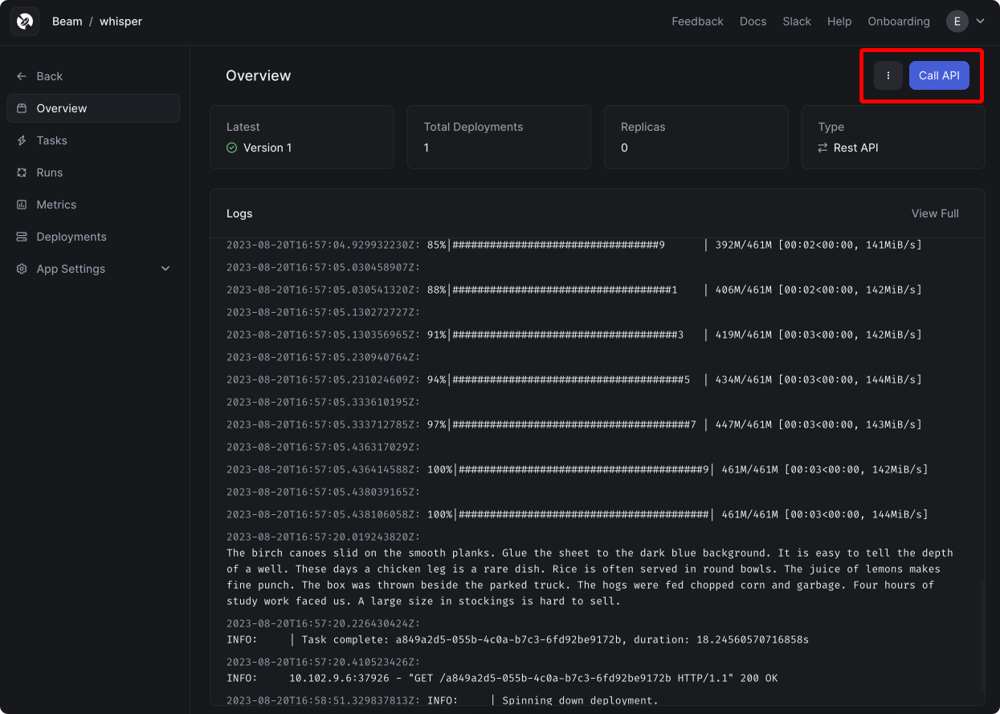
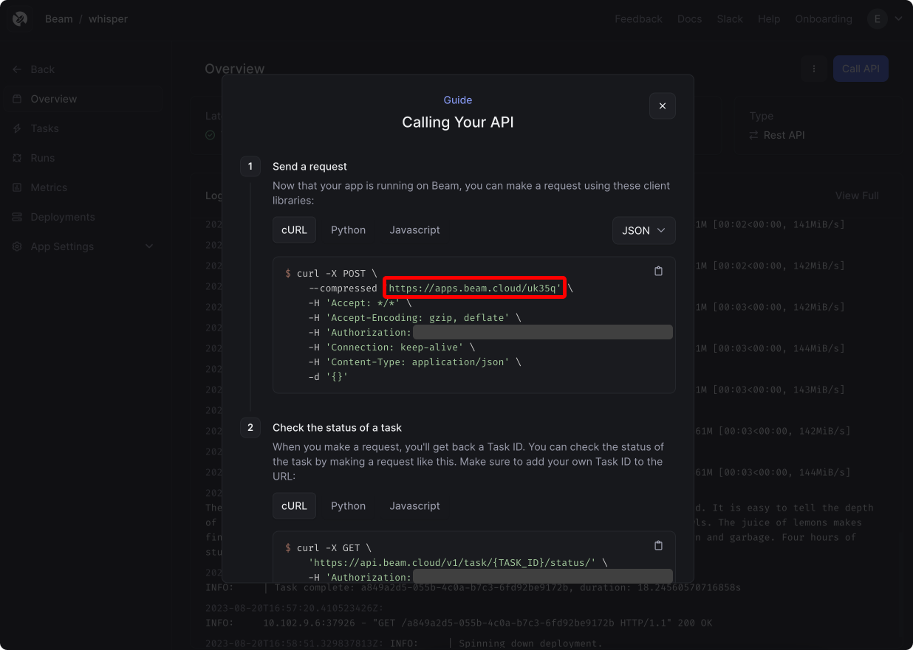
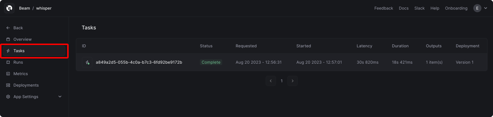
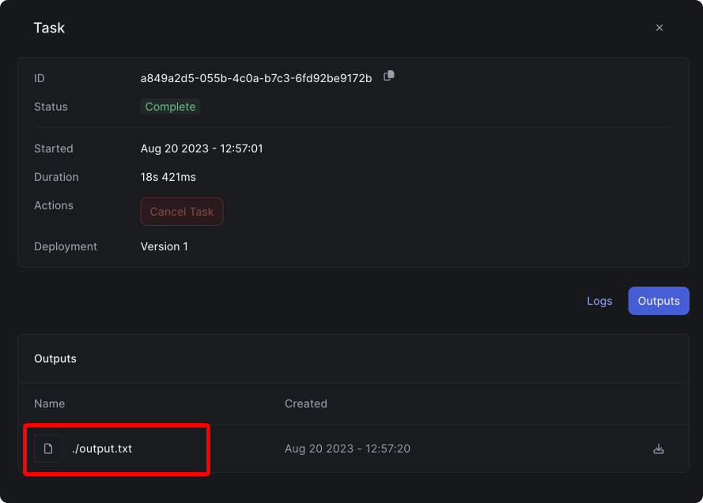

# Test Locally

### Connect to the runtime

```sh
beam start app.py
```

### Run your Python code

```
(beam) python app.py
```

# Deploy

```sh
beam deploy app.py:transcribe_audio
```

# Run Inference

1. Add your Beam client ID and client secret to `request.py`. You can find your Beam credentials [here](https://www.beam.cloud/dashboard/settings/api-keys).
2. Add your App ID. You can find the app ID in the dashboard, under your app:






### Send a request

```python
python request.py
```

> Note: REST APIs have a 90s timeout. If your audio file is large, your request may timeout and continue to run asynchronously. In this case, you can retrieve the output from the API in the dashboard, or through the [`/task`](https://docs.beam.cloud/data/outputs#retrieving-task-outputs) API. 

After you make a request, you'll see a task appear in the dashboard:




### View the output file

To view the transcript, click on your task, and click **Outputs**:



If your task finished running successfully, you'll see a file listed. Click the file, and you'll see the text transcript open in your browser window:


